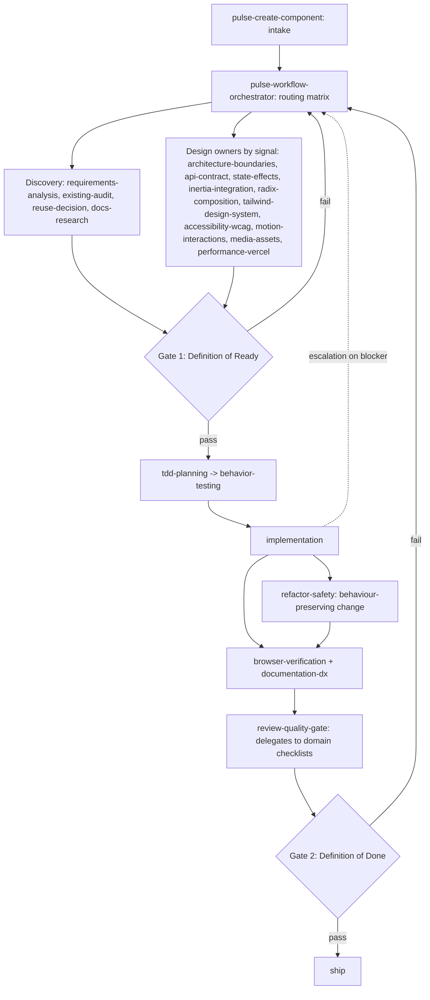

# Pulse Skill Dependency Graph

Generated from `metadata.json` `upstream_skills` / `downstream_skills`, the routing matrix,
and the workflow gates. Routing is deterministic: the orchestrator selects the minimal skill
subset from `pulse-workflow-orchestrator/references/workflow-routing.md`.

## Execution Flow

## Recommended Execution Order

1. `pulse-create-component`
2. `pulse-workflow-orchestrator`
3. `pulse-requirements-analysis`
4. `pulse-existing-audit`
5. `pulse-reuse-decision`
6. `pulse-docs-research`
7. `pulse-architecture-boundaries`
8. `pulse-api-contract`
9. `pulse-state-effects`
10. `pulse-inertia-integration`
11. `pulse-radix-composition`
12. `pulse-tailwind-design-system`
13. `pulse-accessibility-wcag`
14. `pulse-motion-interactions`
15. `pulse-media-assets`
16. `pulse-performance-vercel`
17. Gate 1: Definition of Ready
18. `pulse-tdd-planning`
19. `pulse-behavior-testing`
20. `pulse-implementation` (with `pulse-refactor-safety` for behaviour-preserving change)
21. `pulse-browser-verification`
22. `pulse-documentation-dx`
23. `pulse-review-quality-gate` (Gate 2: Definition of Done)

Phases 7-16 are conditional: only owners whose routing signal is present run.

## Ownership Boundaries

- Intake and orchestration: `pulse-create-component`, `pulse-workflow-orchestrator`.
- Discovery: `pulse-requirements-analysis`, `pulse-existing-audit`, `pulse-reuse-decision`,
  `pulse-docs-research`.
- Design owners: `pulse-architecture-boundaries`, `pulse-api-contract`, `pulse-state-effects`,
  `pulse-inertia-integration`, `pulse-radix-composition`, `pulse-tailwind-design-system`,
  `pulse-accessibility-wcag`, `pulse-motion-interactions`, `pulse-media-assets`,
  `pulse-performance-vercel`.
- Testing and verification: `pulse-tdd-planning`, `pulse-behavior-testing`,
  `pulse-browser-verification`, `pulse-review-quality-gate`.
- Implementation and maintenance: `pulse-implementation`, `pulse-refactor-safety`,
  `pulse-documentation-dx`.

## Gates

- Gate 1 (Definition of Ready) runs before implementation; enforced by the orchestrator.
- Gate 2 (Definition of Done) runs before completion; enforced by `pulse-review-quality-gate`,
  which delegates to domain Completion checklists.

Gate definitions: `pulse-workflow-orchestrator/references/validation-gates.md`.
Routing matrix: `pulse-workflow-orchestrator/references/workflow-routing.md`.
Review delegation: `pulse-workflow-orchestrator/references/review-aggregation.md`.

## Cross-Skill References

Per-skill `upstream_skills` and `downstream_skills` are declared in each `metadata.json`. The
authoritative routing source is the routing matrix; this graph is the human-readable view.
